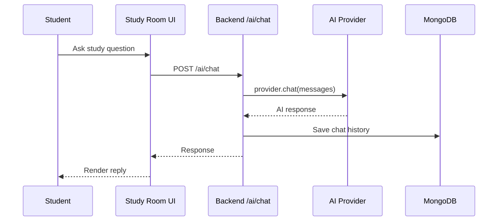

AI-Based Intelligent Study Environment Using Intelligent Agent Architecture (CleverFox)

Abstract
CleverFox is an AI-based intelligent study environment that combines a focused study room interface, task and note management, and a local agent toolchain into a single desktop-ready experience. It integrates a React/Vite frontend, a Node/Express backend, MongoDB persistence, and Electron for desktop packaging. The intelligent agent architecture coordinates user requests, AI chat, and optional action execution through an MCP-inspired tool server and a safe, sandboxed local agent. The system delivers personalized study workflows with timers, notes, tasks, calendar scheduling, and real-time video study sessions.

Introduction
2.1 Overview of Intelligent Study Systems
Intelligent study systems adapt to a learner's context, track progress, and provide guidance using AI and automation. Such systems unify planning, study materials, and feedback loops to reduce context switching and improve retention.

2.2 Importance of AI in Education
AI enables personalized guidance, faster knowledge retrieval, automatic note summarization, and proactive recommendations. In CleverFox, AI reduces manual overhead by generating helpful responses, surfacing relevant notes, and assisting with study tasks.

2.3 Objectives of the Project

- Build a unified, distraction-minimized study environment with AI assistance.
- Provide personalized study support using intelligent agents.
- Integrate tasks, notes, schedule, and chat under a single interface.
- Enable local agent tooling for safe automation and document generation.
- Support real-time study sessions with audio/video signaling.

Literature Survey
3.1 Existing Study Platforms
Platforms such as LMS tools, note apps, and calendar utilities provide partial solutions (note-taking, scheduling, or chat). Most operate as separate silos that require the learner to coordinate their own workflow.

3.2 Limitations of Traditional Learning Systems
Traditional systems are reactive and fragmented. Users must manually copy information between tools, and these systems rarely adapt to learner behavior or context.

3.3 Need for Intelligent Agent-Based Learning
Agent-based systems can reason about tasks, propose actions, and complete multi-step workflows. CleverFox adopts this approach by combining an AI chat layer with a local agent and MCP tooling to automate study workflows.

System Analysis
4.1 Existing System
Typical study workflows involve multiple tools: a notes app, a task list, a calendar, a chat assistant, and separate video call software. This causes fragmentation and inconsistent context across tools.

4.2 Proposed System
CleverFox unifies the workflow into a single interface with a backend that manages tasks, notes, schedules, and AI interactions. The AI layer includes web search augmentation, a routing layer for intent classification, and optional local agent execution.

4.3 Advantages of Proposed System

- Unified study room with integrated tools.
- AI chat integrated with study context.
- Local agent actions for file and command automation.
- Persistent data via MongoDB.
- Desktop packaging via Electron for focused sessions.

System Architecture
5.1 Overview of Intelligent Agent Architecture
The system uses a layered architecture where the frontend captures user intent, the backend routes requests to either chat or agent flows, and the AI provider generates responses. A local agent performs approved actions (file operations, command execution) in a sandboxed workspace.

5.2 Types of Agents Used (Learning Agent, Recommendation Agent, etc.)

- Learning Agent (Fox AI): responds to study prompts and general queries.
- Action Agent (Local Agent): executes controlled tool actions (files, commands, directories).
- Recommendation Logic: derived from task progress, schedule, and study patterns.

  5.3 Architecture Diagram
  Figure 5.3: System architecture overview



System Design
6.1 Data Flow Diagram (DFD)
Figure 6.1: Data flow diagram



6.2 Use Case Diagram
Figure 6.2: Use case diagram


6.3 Sequence Diagram
Figure 6.3: Sequence diagram for AI chat



6.4 Class Diagram
Figure 6.4: Core data model class diagram



Technology Stack
7.1 Programming Languages Used

- TypeScript (frontend and backend)
- JavaScript (tooling and build scripts)

  7.2 Tools and Frameworks

- Frontend: React, Vite, Chakra UI, Mantine, Tailwind CSS
- Backend: Node.js, Express, Socket.IO
- Desktop: Electron
- Database: MongoDB (Mongoose)
- AI Providers: Gemini, OpenAI, Ollama (configurable)
- MCP tooling: Model Context Protocol server

  7.3 AI Techniques Used (Machine Learning, NLP, etc.)

- Natural Language Processing (prompt-based interaction)
- Tool-augmented reasoning (agent proposal + execution)
- Web search augmentation for current information

Module Description
8.1 User Registration & Login Module
The UI includes login and signup screens with validation and UX flows. User identity is handled in the client flow and can be extended to a backend auth system.

8.2 Personalized Learning Module
The study room aggregates tools such as tasks, notes, calendar, and timer. The user can customize focus sessions and manage study artifacts within a single interface.

8.3 Intelligent Recommendation Module
Recommendations are driven by AI responses, task status, and schedule context. The agent can propose actions or generate notes based on user prompts.

8.4 Performance Tracking Module
Task statistics and completion states, along with timers, provide insight into study progress. Task progress can be computed from subtasks and stored.

8.5 Feedback & Assessment Module
Fox AI provides conversational feedback, summarization, and guidance. Study notes can be created and stored for later review.

Implementation
9.1 Development Process

- Frontend: Vite + React UI for landing, login, and study room tools.
- Backend: Express API routes for tasks, notes, schedules, and AI chat.
- Persistence: MongoDB models for core entities.
- Desktop: Electron for focused desktop execution.
- Realtime: Socket.IO signaling for video sessions.

  9.2 Algorithm/Logic Used

- Pomodoro timer logic for focus/break cycles in the study room.
- Task progress computation based on subtask completion.
- Intent routing to decide between chat and agent execution.
- Agent loop for proposing and executing tools safely.

  9.3 Screenshots of the System

- Landing page
- Study room tools (Tasks, Notes, Calendar, Fox AI)
- Video session UI

Results and Discussion
10.1 Output Screens
The study room interface successfully integrates multiple learning tools in a unified workspace. AI responses are available in real time, and tasks and notes are persisted.

10.2 Performance Analysis

- Frontend remains responsive due to modular UI components.
- Backend API latency is minimal for CRUD operations.
- AI response time depends on provider latency and network conditions.

  10.3 Comparison with Existing Systems
  CleverFox reduces tool fragmentation by combining planning, study assets, and AI guidance. Unlike standalone note or calendar apps, it provides AI-assisted context across modules.

Advantages and Limitations
11.1 Advantages

- Unified study workflow in one application.
- Agent architecture enables automation and AI assistance.
- Desktop app improves focus and reduces browser distractions.

  11.2 Limitations

- AI provider API keys are required for full functionality.
- Some AI tasks can be compute-intensive.
- Authentication is currently a frontend flow and needs production hardening.

Future Enhancements

- Full user authentication and multi-user profiles.
- Richer recommendations using study history analytics.
- Offline local model support for privacy-first usage.
- Expanded collaboration tools for group study sessions.

Conclusion
CleverFox demonstrates a complete AI-based study environment that merges productivity tools with an intelligent agent architecture. By integrating AI, planning, and execution in a single interface, it provides a practical foundation for modern, personalized learning.

References

- React, Vite, and Electron official documentation
- MongoDB and Mongoose documentation
- Model Context Protocol (MCP) documentation

Appendix
Example code excerpts (trimmed for clarity)

A. Agent Controller loop (simplified)

```typescript
export class AgentController {
  private messages: { role: string; content: string }[] = [];

  async processPrompt(prompt: string): Promise<string> {
    this.messages.push({ role: "user", content: prompt });
    let loopCount = 0;
    let finalResult = "";

    while (loopCount < 10) {
      loopCount++;
      if (loopCount === 1) {
        finalResult += "\n1. Generating Python code...";
      }
      if (loopCount === 7) {
        finalResult += "\nWorkflow Complete.";
        break;
      }
    }

    return finalResult;
  }
}
```

B. Task model (partial)

```typescript
export type TaskStatus = "pending" | "inProgress" | "completed";

const taskSchema = new Schema<TaskDoc>({
  title: { type: String, required: true, trim: true },
  status: {
    type: String,
    enum: ["pending", "inProgress", "completed"],
    default: "pending",
  },
  progress: { type: Number, min: 0, max: 100, default: 0, required: true },
});
```

C. Video session signaling (partial)

```typescript
io.on("connection", (socket) => {
  socket.on("video:create-session", (payload, ack) => {
    const sessionId = generateSessionId();
    socket.join(sessionId);
    if (typeof ack === "function") {
      ack({
        ok: true,
        data: { sessionId, selfId: socket.id, participants: [] },
      });
    }
  });
});
```
